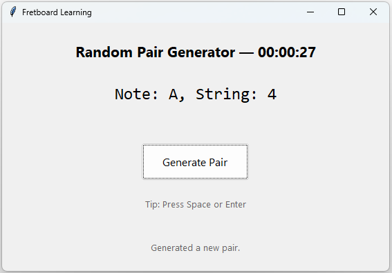

# Freatboard_Learning — Application Overview

## 📌 Description
This application is a simple graphical tool built with **Python** and **Tkinter** that generates a random pair consisting of:
- A **letter** from `[C, A, G]`
- A **number** from `[1, 2, 3, 4, 5, 6]`

Each generated pair appears in the format:
```
Note: <letter>, String: <number>
```

## 🎯 Key Features
### 🔹 Random Pair Generation
Each click produces a new random combination of one letter and one number.

### 🔹 No Immediate Repetition
The app keeps track of the last generated pair (saved in a small `.last_pair.json` file). When generating a new pair, it ensures the new result is **never equal to the previous one**, even across different runs of the app.

### 🔹 Stopwatch (Starts on First Use)
A built-in stopwatch appears in the window header. It:
- Starts **only after the first time you generate a pair**
- Continues running indefinitely
- Updates every second
- Helps you track how long you’ve been using the tool

### 🔹 Clean and Minimal UI
To keep the interface focused and simple:
- Only the current generated pair is displayed
- The previous pair is *not* shown in the GUI
- A single, large button is centered to trigger generation
- Space and Enter keys also trigger the button

## 🧠 Internal Behavior
The application:
1. Loads the previous generated pair from `.last_pair.json` (if available)
2. Waits for the user to press the **Generate Pair** button
3. Starts the stopwatch on first press
4. Generates a random pair
5. Ensures it is **not equal** to the previous one
6. Displays it on the screen
7. Saves it for the next session

This design makes the application behave consistently and avoids accidental duplication.

## 🚀 Technologies Used
- **Python 3**
- **Tkinter** (standard Python GUI library)
- **json** module for state persistence
- **time.monotonic()** for precise stopwatch timing
- **Pathlib** for file handling

## 📂 File Persistence
The app stores its last generated pair in:
```
.last_pair.json
```
This file lives in the same directory as the script and is automatically updated.

## ⚙️ How to Run
1. Save the script as `fretboard_gui.py`
2. Run it with:
   ```bash
   python fretboard_gui.py
   ```
3. Click **Generate Pair** (or press Space/Enter)
4. Watch the stopwatch start and enjoy using the tool

## 📝 Author Notes
This markdown document describes the updated version of the GUI where:
- The **Previous:** label has been removed
- The stopwatch starts only after the first pair generation
- The interface remains clean and playful

